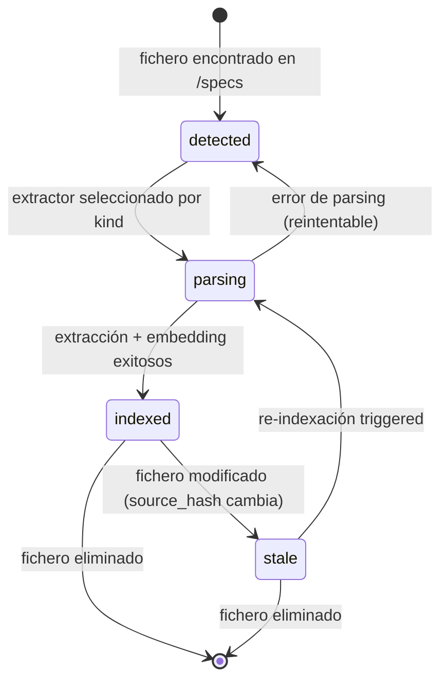

# KDDDocument

## Descripción

Un [[KDDDocument]] representa un fichero de especificación KDD parseado por el motor de indexación. Es la unidad atómica de entrada al pipeline: cada archivo `.md` o `.yaml` dentro de `/specs` que contiene front-matter válido con un `kind` reconocido se convierte en un KDDDocument.

El motor detecta el `kind` del documento (entity, command, business-rule, etc.) mediante [[BR-DOCUMENT-001]] y aplica el extractor correspondiente para producir un [[GraphNode]] (representación estructurada en el grafo), [[GraphEdge|edges]] (relaciones con otros nodos) y [[Embedding|embeddings]] (vectores semánticos de los párrafos del texto original).

## Atributos

| Atributo | Tipo | Requerido | Descripción |
|----------|------|-----------|-------------|
| `id` | `string` | Sí | Identificador único derivado del front-matter `id` o del nombre de fichero |
| `kind` | `KDDKind` | Sí | Tipo de artefacto KDD (`entity`, `command`, `business-rule`, etc.) |
| `source_path` | `string` | Sí | Ruta relativa al fichero fuente dentro del repositorio (e.g. `specs/01-domain/entities/Pedido.md`) |
| `source_hash` | `string` | Sí | Hash SHA-256 del contenido del fichero para detectar cambios |
| `layer` | `KDDLayer` | Sí | Capa KDD a la que pertenece (`00-requirements`, `01-domain`, `02-behavior`, `03-experience`, `04-verification`) |
| `front_matter` | `dict` | Sí | Front-matter YAML parseado completo |
| `sections` | `list[Section]` | Sí | Lista de secciones Markdown extraídas (heading + contenido) |
| `wiki_links` | `list[string]` | No | Wiki-links `[[...]]` encontrados en el contenido |
| `status` | `DocumentStatus` | Sí | Estado actual del documento en el pipeline de indexación |
| `indexed_at` | `datetime` | No | Timestamp de la última indexación exitosa |
| `domain` | `string` | No | Dominio al que pertenece en estructura multi-domain (e.g. `core`, `auth`) |

## Ciclo de Vida

### Eventos del ciclo de vida

| Transición | Evento |
|------------|--------|
| `[*] → detected` | [[EVT-KDDDocument-Detected]] |
| `detected → parsing` | Interno (no emite evento) |
| `parsing → indexed` | [[EVT-KDDDocument-Indexed]] |
| `detected/stale → parsing` | [[EVT-KDDDocument-Parsed]] |
| `indexed → stale` | [[EVT-KDDDocument-Stale]] |

## Relaciones

| Relación | Cardinalidad | Destino | Descripción |
|----------|-------------|---------|-------------|
| produce nodo | 1:1 | [[GraphNode]] | Un documento produce exactamente un nodo en el grafo |
| genera edges | 1:N | [[GraphEdge]] | Las wiki-links y relaciones del documento generan edges |
| produce embeddings | 1:N | [[Embedding]] | Los párrafos de secciones embebibles generan vectores semánticos (producto hermano de los nodos) |
| pertenece a | N:1 | [[IndexManifest]] | Todo documento indexado está registrado en un manifiesto |

## Invariantes

- El `kind` debe ser uno de los tipos reconocidos por el KDD Model Reference.
- El `source_path` debe estar dentro de la carpeta `/specs` y la `layer` debe coincidir con el prefijo de la carpeta (e.g. `01-domain/entities/` → `01-domain`).
- El `source_hash` debe recalcularse en cada detección para determinar si el documento está `stale`.
- Un documento en estado `indexed` siempre tiene al menos un [[GraphNode]] asociado.
- Un documento eliminado del filesystem provoca la eliminación en cascada de sus nodos, edges y embeddings asociados.
