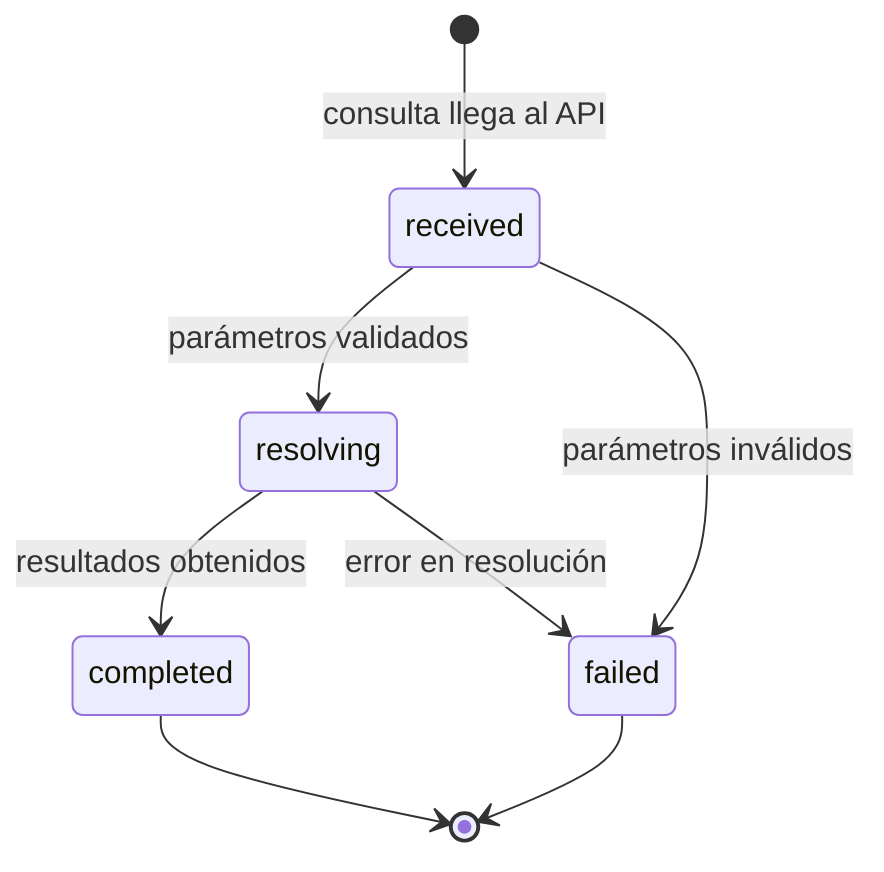

# RetrievalQuery

## Descripción

Una [[RetrievalQuery]] representa una consulta de un agente de IA (o desarrollador humano) al motor de retrieval. Encapsula los parámetros de búsqueda, la estrategia de retrieval seleccionada y el estado de resolución de la consulta.

Las estrategias disponibles son:
- **graph**: traversal del grafo por nodo, relación y profundidad ([[QRY-001-RetrieveByGraph]]).
- **semantic**: búsqueda por similitud vectorial sobre [[Embedding|embeddings]] ([[QRY-002-RetrieveSemantic]]).
- **hybrid**: combinación de grafo + semántica + lexical con fusion scoring ([[QRY-003-RetrieveHybrid]]).
- **impact**: análisis de impacto desde un nodo ([[QRY-004-RetrieveImpact]]).

## Atributos

| Atributo | Tipo | Requerido | Descripción |
|----------|------|-----------|-------------|
| `id` | `uuid` | Sí | Identificador único de la consulta |
| `query_text` | `string` | No | Texto de búsqueda en lenguaje natural (requerido para `semantic` y `hybrid`) |
| `strategy` | `RetrievalStrategy` | Sí | Estrategia de retrieval: `graph`, `semantic`, `hybrid`, `impact` |
| `root_node` | `string` | No | ID del nodo raíz para `graph` e `impact` (e.g. `Entity:Pedido`) |
| `depth` | `int` | No | Profundidad de traversal para `graph` e `impact`. Default `2` |
| `edge_types` | `list[string]` | No | Tipos de edge a seguir en traversal. Si vacío, todos |
| `include_kinds` | `list[KDDKind]` | No | Filtro por `kind` de nodo en resultados |
| `include_layers` | `list[KDDLayer]` | No | Filtro por capa KDD en resultados |
| `respect_layers` | `bool` | No | Si `true`, excluye resultados que violan dependencias de capa. Default `true` |
| `min_score` | `float` | No | Score mínimo para resultados semánticos (0.0–1.0). Default `0.7` |
| `limit` | `int` | No | Número máximo de resultados. Default `10` |
| `max_tokens` | `int` | No | Límite de tokens en la respuesta (para `hybrid`). Default `8000` |
| `status` | `QueryStatus` | Sí | Estado actual de la consulta |
| `received_at` | `datetime` | Sí | Timestamp de recepción |
| `completed_at` | `datetime` | No | Timestamp de finalización |
| `duration_ms` | `int` | No | Duración de la resolución en milisegundos |
| `caller` | `string` | No | Identificador del agente o usuario que realizó la consulta |

## Ciclo de Vida

### Eventos del ciclo de vida

| Transición | Evento |
|------------|--------|
| `[*] → received` | [[EVT-RetrievalQuery-Received]] |
| `resolving → completed` | [[EVT-RetrievalQuery-Completed]] |
| `resolving → failed` | [[EVT-RetrievalQuery-Failed]] |

## Relaciones

| Relación | Cardinalidad | Destino | Descripción |
|----------|-------------|---------|-------------|
| produce | 1:1 | [[RetrievalResult]] | Cada consulta completada produce un resultado |

## Invariantes

- Si `strategy` es `semantic` o `hybrid`, `query_text` es obligatorio.
- Si `strategy` es `graph` o `impact`, `root_node` es obligatorio.
- El `limit` debe ser > 0 y ≤ 100.
- Una consulta en estado `completed` siempre tiene un [[RetrievalResult]] asociado.
- El `duration_ms` se calcula como `completed_at - received_at` y debe cumplir el SLO de P95 < 300ms según [[REQ-001-Performance]].
