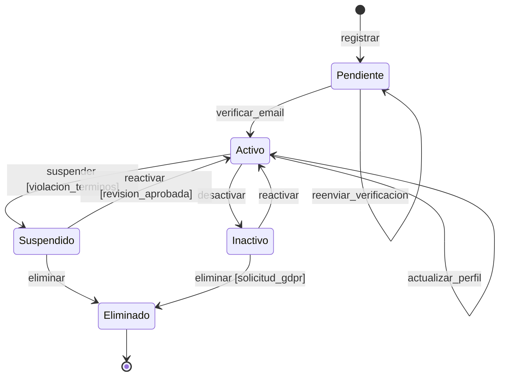

# Usuario

## Descripción

Representa a una persona que interactúa con el sistema. El Usuario es la entidad central del dominio de identidad y autenticación. Gestiona la información personal, credenciales de acceso y permisos dentro de la plataforma.

Características principales:
- Puede autenticarse mediante email/contraseña o proveedores OAuth
- Tiene un perfil editable con información personal
- Puede pertenecer a múltiples organizaciones con diferentes roles

## Atributos

| Atributo | Code | Tipo | Descripción |
|----------|------|------|-------------|
| `id` | `id` | uuid | Identificador único del usuario |
| `email` | `email` | string | Correo electrónico único, usado para login |
| `nombre` | `firstName` | string | Nombre de pila del usuario |
| `apellido` | `lastName` | string | Apellido del usuario |
| `estado` | `status` | enum | Estado del ciclo de vida |
| `avatar_url` | `avatarUrl` | string? | URL de la imagen de perfil |
| `organizacion_id` | `organizationId` | [[Organizacion]] | Organización principal del usuario |
| `created_at` | `createdAt` | timestamp | Fecha de registro |
| `last_login_at` | `lastLoginAt` | timestamp? | Último acceso al sistema |

## Relaciones

| Relación | Code | Cardinalidad | Entidad | Descripción |
|----------|------|--------------|---------|-------------|
| `pertenece a` | `organization` | N:1 | [[Organizacion]] | Organización principal |
| `tiene` | `roles` | 1:N | [[RolUsuario]] | Roles asignados en diferentes contextos |
| `creó` | `documents` | 1:N | [[Documento]] | Documentos creados por el usuario |
| `participa en` | `projects` | N:M | [[Proyecto]] | Proyectos donde colabora |

## Ciclo de Vida

### Estados

| Estado | Descripción | Condiciones de entrada |
|--------|-------------|------------------------|
| **Pendiente** | Usuario registrado pero sin verificar email | Registro completado |
| **Activo** | Usuario con acceso completo al sistema | Email verificado o reactivación |
| **Suspendido** | Acceso temporalmente revocado | Violación de términos de servicio |
| **Inactivo** | Usuario que desactivó voluntariamente su cuenta | Solicitud del usuario |
| **Eliminado** | Datos anonimizados, cuenta no recuperable | Solicitud GDPR o eliminación admin |

## Invariantes

- El email debe ser único en todo el sistema
- Un usuario activo debe tener al menos un rol asignado
- El estado no puede cambiar de Eliminado a ningún otro estado
- last_login_at solo se actualiza cuando el usuario está Activo

## Eventos

- **Emite**: [[EVT-Usuario-Registrado]], [[EVT-Usuario-Verificado]], [[EVT-Usuario-Actualizado]], [[EVT-Usuario-Suspendido]], [[EVT-Usuario-Eliminado]]
- **Consume**: [[EVT-Organizacion-Eliminada]] (desactiva usuarios asociados)
